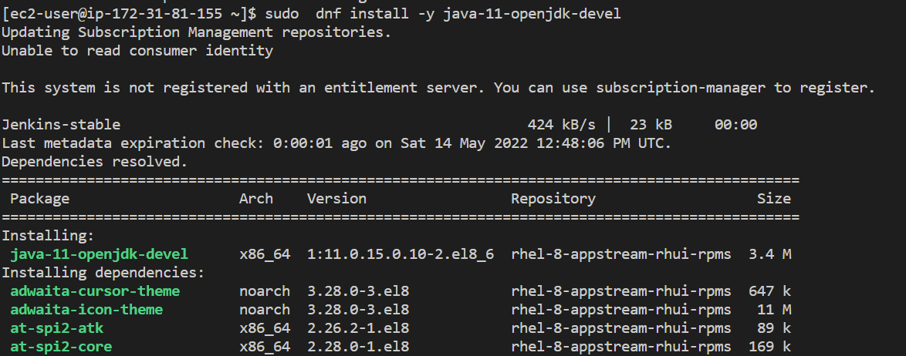

# CONTINUOUS INTEGRATION WITH JENKINS  ANSIBLE  ARTIFACTORY  SONARQUBE  PHP

## Set up enviroments for ci/cd pipeline

installing necessary applications and dependencies on jenkins, nginx, database and tooling servers.

Create redhat ec2 instance

configure instance

`sudo dnf install wget -y`

`sudo dnf install -y java-11-openjdk-devel`

`java -version` 

`sudo alternatives --config java`

`sudo dnf install -y jenkins`

`sudo systemctl start jenkins`

`sudo systemctl enable jenkins`

`sudoo systemctl status jenkins`

Set up jenkins 

Create a folder deploy in ansible config repo and create a jenkinsfile with below configurations

Set up jenkins and add the jenkinsfile to the build configuration

Run build 

Set up blue ocean ui on jenkins

