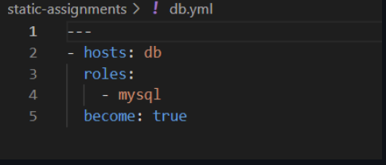
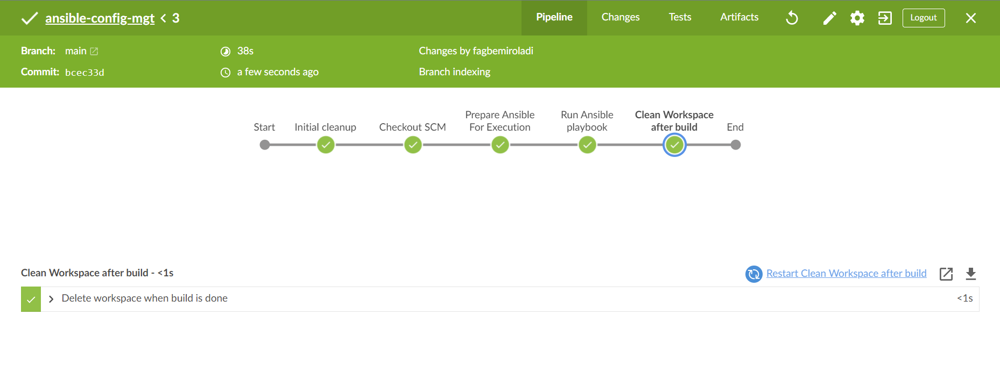
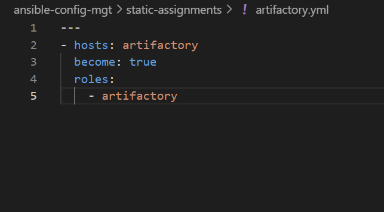
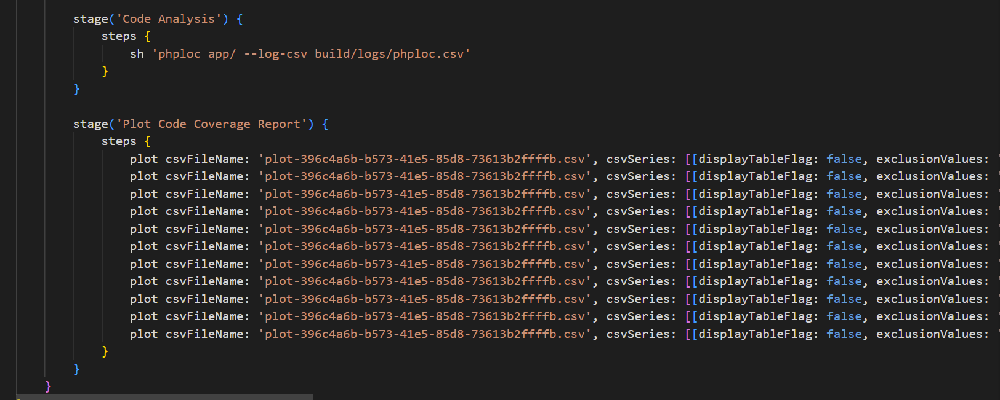
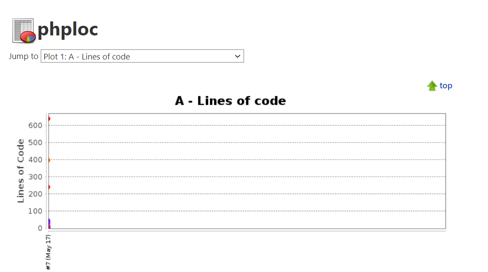
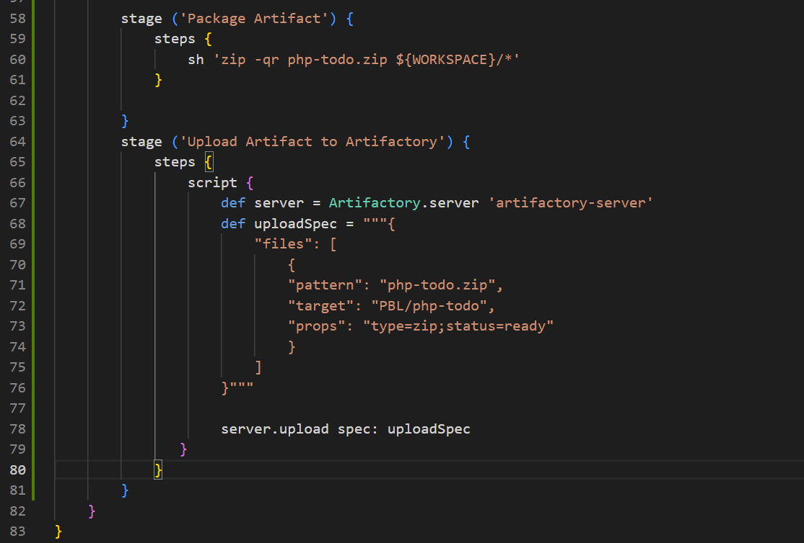
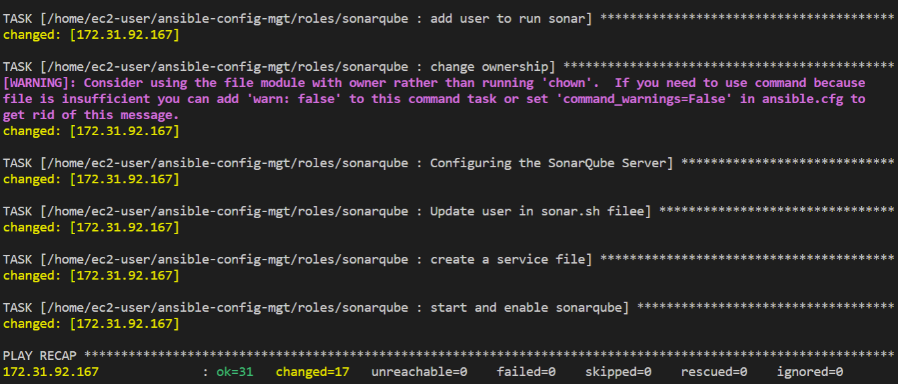

# CONTINUOUS INTEGRATION WITH JENKINS  ANSIBLE  ARTIFACTORY  SONARQUBE  PHP

## Set up enviroments for ci/cd pipeline

installing necessary applications and dependencies on jenkins, nginx, database and tooling servers.

Create redhat ec2 instance

configure instance

`sudo dnf install wget -y`

`sudo dnf install -y java-11-openjdk-devel`

`java -version` 

`sudo alternatives --config java`

`sudo dnf install -y jenkins`

`sudo systemctl start jenkins`

`sudo systemctl enable jenkins`

`sudoo systemctl status jenkins`

Set up jenkins 

Create a folder deploy in ansible config repo and create a jenkinsfile with below configurations

Set up jenkins and add the jenkinsfile to the build configuration

Run build 

Set up blue ocean ui on jenkins

created a new git branch for the jenkinspipline-stages

added test stage script in jenkins file under the branch to trigger a build

Pushed chnages from new branch to main branch

Added 3 stages - package, deploy, clean up

Updated git repo to initiate build

pushed changes from new branch to main 

## Configuring ansible on jenkins server

Installed ansible and its dependencies on jenkins server

Installed ansible plugin on jenkins ui

Added new scripts to jenkinsfile

Updated ansible.cfg with the necessary configurations

Updated necessary environments in the inventory directory

installed and configured postgresql and nginx role from ansible galaxy

updated the ansible playbooks/site.yml and static-assignments file

Pushed changes to git repo and merged with main

Introduced parametization in jenkinsfile so the different env's can be executed without needing to manually change and update the

## ci/cd pipeline for todo application

cloned https://github.com/ladifa1/php-todo.git repo

Installed php, its dependencies and composer tool on jenkins server

Installed ansible artifactory role

Installed plot plugin and artifactory plugin on jenkins ui

Configure artifactory on jenkins ui

Created new jenkins file on todo repo

Configure inevntory file, playbooks and static-assignments

Created multibranch pipeline on blue ocean and run build on CI

open artifactory url

Created database and database user on db server

Updated jenkinsfile with pipeline config

Run php-todo build 

Install phploc

Updating jenkinsfile, static-assignments, playbook and builds

## sonarqube 

installed sonarqube

Updated inventory, playbooks and static-assignments

installed java

installed postgresql db for sonarqube

configured sonarqube and open port 9000

## Configure slave user on jenkins

installed java on slave

updated bash profile with java

configured slave node on jenkins

configured github webhook trigger

